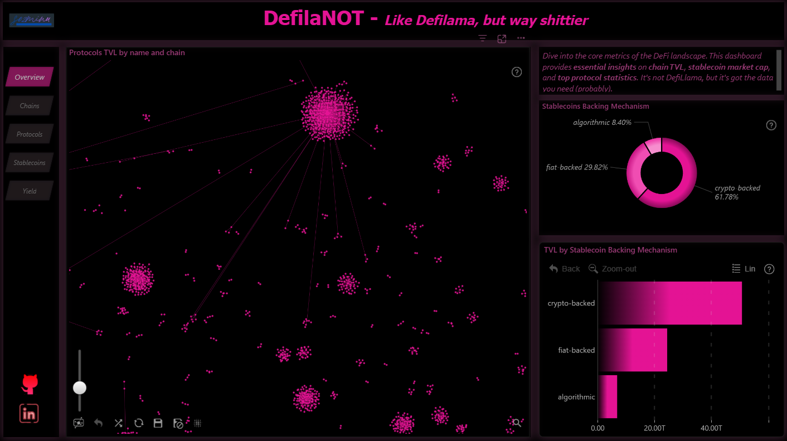

# DeFi Analytics Dashboard (DeFiLlama-Inspired)

## 📌 Project Overview

This project is a **DeFi analytics dashboard** inspired by platforms such as **DeFiLlama**, with a strong focus on **visual clarity, usability, and exploratory analysis**.

The dashboard was developed as part of an academic project and is designed to act as a **centralized analytical layer** for blockchain networks, DeFi metrics, and ecosystem-level insights.

While the current version uses **simulated and limited data**, the **data model and architecture were built to support future integration with live, reliable APIs**.

> This screenshot shows the current state of the dashboard.
> 👉 **[Open the Power BI Dashboard](https://app.powerbi.com/links/q-x8qtwY8F?ctid=00d4521c-d27c-4570-bc5b-1f1018eef95c&pbi_source=linkShare)**

---

## 🎯 Objectives

- Provide a clear and intuitive overview of the DeFi ecosystem  
- Enable **chain-level and metric-level comparisons**  
- Emphasize **visual storytelling** for complex blockchain data  
- Build a **scalable analytical foundation** for future expansion  

---

## 📊 Key Features

### 🔗 Chain Comparison  
Compare multiple blockchain networks across key DeFi metrics in a single analytical view.

### 🎛 Interactive Filtering  
Dynamic filters allow users to isolate specific chains, categories, or KPIs for targeted exploration.

### 🔍 Macro-to-Micro Analysis  
Navigate smoothly from high-level ecosystem trends down to detailed metrics without losing context.

### 🎨 Visual-First Design  
The dashboard prioritizes **readability, hierarchy, and contrast**, using layout and color strategically to reduce cognitive load.

---

## 🛠 Tools & Technologies

- **Power BI** – dashboard design, modeling, and visualization  
- **DAX** – calculated measures and aggregations  
- **CSV / API-style datasets** – used to simulate DeFi metrics  

---

## ⚠️ Data Disclaimer

Due to restricted access to **paid APIs** such as DeFiLlama’s full API, the dataset in this version is **not real-time or fully accurate**.

The goal of this project is not data accuracy but:

- Dashboard architecture  
- Data modeling  
- Visual design  
- Analytical structure  

The project was intentionally designed to be **upgradeable** to production-grade data sources.

---

## 🚀 Future Improvements

- Integration with verified DeFi data providers (DeFiLlama, Flipside, Dune)  
- Real-time or scheduled data refresh  
- Protocol-level analytics  
- Historical and time-series tracking  
- UI and performance optimization  

---

## 🎓 Academic Context

This project was built as part of an academic assignment to demonstrate:

- Data visualization best practices  
- Analytical reasoning in DeFi and blockchain contexts  
- Scalable dashboard and data-model design  

---

## 📬 Contact

If you have feedback, questions, or want to collaborate on future iterations, feel free to reach out.

